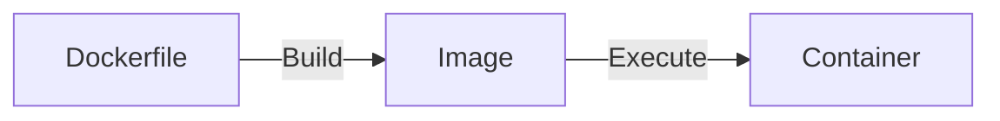

# Docker



```sh
# List docker images
docker images ls

# List running containers
docker ps

# https://docs.docker.com/engine/reference/commandline/builder_build/
# Build an image using Dockerfile
# --tag , -t: Name and optionally a tag in the 'name:tag' format
docker build -t simple-docker:latest .

# Run a container
docker run simple-docker:latest
```

# Docker Hub

https://hub.docker.com/

# .dockerignore

Ignore specified files when copying files to workdir.
