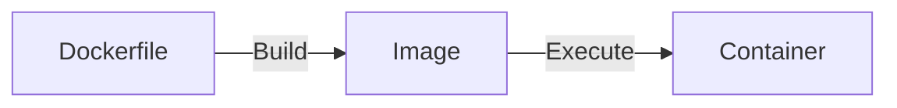

# Docker



```sh
# List images
docker images

# Remove images
docker rmi <image-id> <image-id>
# Remove all images
docker rmi $(docker images -q)

# List running containers
docker ps

# Remove container
docker rm
# Stop all containers
docker stop $(docker ps -a -q)
# Remove all containers
docker rm $(docker ps -a -q)

# https://docs.docker.com/engine/reference/commandline/builder_build/
# Build an image using Dockerfile
# --tag , -t: Name and optionally a tag in the 'name:tag' format
docker build -t simple-docker:latest .

# Run a container
docker run simple-docker:latest
```

# Docker Hub

https://hub.docker.com/

# .dockerignore

Ignore specified files when copying files to WORKDIR.
