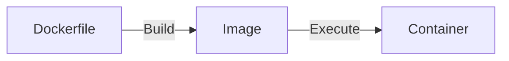

# Docker



## Commands

```sh
# List images
docker images

# Remove images
docker rmi <image-id> <image-id>
# Remove all images
docker rmi $(docker images -q)

# List running containers
docker ps
docker ps -a # all

# Remove container
docker rm <container-id>
# Stop all containers
docker stop $(docker ps -a -q)
# Remove all containers
docker rm $(docker ps -a -q)

# https://docs.docker.com/engine/reference/commandline/builder_build/
# Build an image using Dockerfile
# --tag , -t: Name and optionally a tag in the 'name:tag' format
docker build -t simple-docker:latest .

# Run a container
docker run simple-docker:latest # you can omit `latest`

# Stop a container
docker stop <container-id> # Or first unique letters

# Pull an image from docker hub
docker pull <image-name>
# Now you can see the downloaded image by running `docker images ls`

# Run download image
docker run --rm -p 3000:3000 <image-name>
docker run --pull=always --rm -p 3000:3000 <image-name> # Pull the image and run

# bash
docker exec -it <container-id> bash

# Restart
docker restart <container-id>

# After changing contents of a container, you can commit it.
docker commit <container-id> <image-name>

# Push changes to create a new image
docker push <image-name>

# Remove all stopped containers
docker container prune -f # -f: forcefully

# Remove unused images
docker image prune -a -f # -a: all, -f: forcefully

# Remove unused data
docker system prune
docker system prune -a -f # all and forcefully

# Display system-wide information
docker system info

# Show docker disk usage
docker system df

# Show logs
docker logs <container-id>

# Display a live stream of container(s) resource usage statistics
docker stats
```

# Docker Hub

https://hub.docker.com/

# Docker Login

Create access token.

<image width='500' src='images/login.png'>

```sh
docker login -u <username>
```

# Docker Pull
