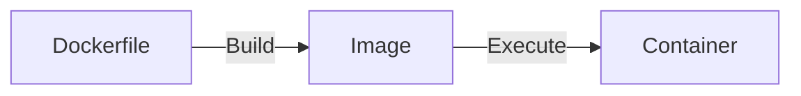

# Docker



```sh
# List images
docker images

# Remove images
docker rmi <image-id> <image-id>
# Remove all images
docker rmi $(docker images -q)

# List running containers
docker ps
docker ps -a # all

# Remove container
docker rm
# Stop all containers
docker stop $(docker ps -a -q)
# Remove all containers
docker rm $(docker ps -a -q)

# https://docs.docker.com/engine/reference/commandline/builder_build/
# Build an image using Dockerfile
# --tag , -t: Name and optionally a tag in the 'name:tag' format
docker build -t simple-docker:latest .

# Run a container
docker run simple-docker:latest

# Stop a container
docker stop <container-id>

> You can use a shorthand as long as it is unique

> e.g. container-id=b43b178f8d2a

> docker stop b43 -> as long as it's unique in the system
```

# Docker Hub

https://hub.docker.com/
